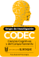

# CODEC — Ciencias Cognitivas y del Comportamiento



Repositorio del sitio web del grupo de investigación **CODEC: Ciencias Cognitivas y del Comportamiento** (clasificación **A1**), adscrito a la Facultad de Psicología de la **Universidad El Bosque**, Bogotá, Colombia.

El grupo estudia la cognición y el comportamiento humano desde perspectivas evolutivas, neurocientíficas y neuropsicológicas, articuladas en tres líneas de investigación:

- **Línea 1 — Evolución y Comportamiento Humano** (EvoCo)
- **Línea 2 — Neurociencias cognitivo-afectivas** (LabPsiExp)
- **Línea 3 — Neuropsicología** (NeuroGroup)

## Tecnología

El sitio está construido con [Astro](https://astro.build) y [Tailwind CSS](https://tailwindcss.com), y se despliega automáticamente en Netlify desde este repositorio.

## Desarrollo local

```bash
pnpm install
pnpm dev
```

## Autor

Creado y mantenido por [Juan David Leongómez](https://jdleongomez.info), líder del grupo CODEC.
